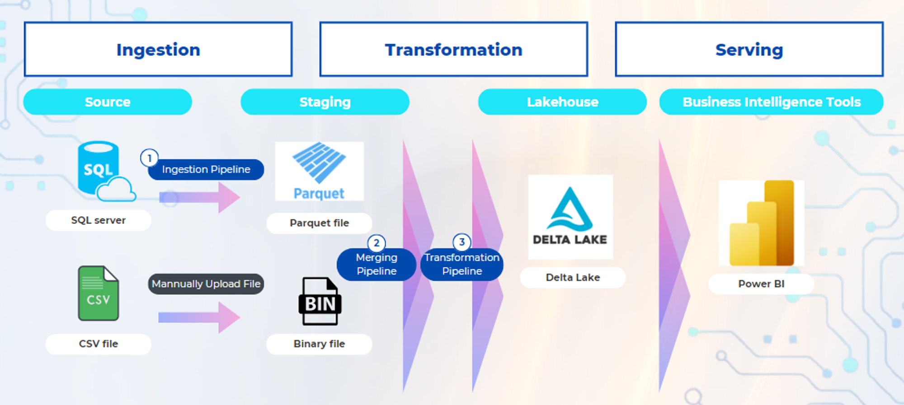

Hello, today I'm going show my ETL pipeline project that I learned during my Data Engineer internship at BBIK.

# Overview
This project overview involves creating an ETL pipeline from extracting data from the data source to delivering quality data for presentation in a PowerBI dashboard, primarily using Microsoft Azure: Cloud Computing Services.

For the ETL process in this project, it includes extracting data from the data source (SQL Server), followed by data transformation at the staging area (Data Lake), before loading it into the Lakehouse (Delta Lake)

# Process
The process overview can be summarized as follows:

- **Ingestion:** Extract data from various data sources, such as SQL Server, to store in the staging area and merge the data into the Lakehouse.
- **Transformation:** Transform the data in the Lakehouse into a format that is ready for analysis.
- **Serving:** Connect the data from the Lakehouse to a BI tool like PowerBI to create dashboards according to business requirements.

# Techstack

# Code
You can find the code here, along with an article that discusses the details of this project, at this link <link>.
- [main_merge_pipeline.ipynb](https://github.com/Nippypipo/Azure_ETL_Data_engineer_Project/blob/main/spark_notebook/main_merge_pipeline.ipynb).
- [merge_functions.ipynb
](https://github.com/Nippypipo/Azure_ETL_Data_engineer_Project/blob/main/spark_notebook/merge_functions.ipynb)
- [test_merge_functions.ipynb](https://github.com/Nippypipo/Azure_ETL_Data_engineer_Project/blob/main/spark_notebook/test_merge_functions.ipynb)

# References
